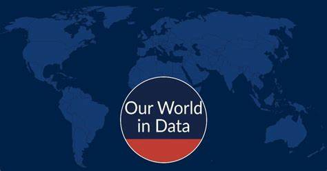

<style>
.logo{
display:block;
margin-left:auto;
margin-right:auto;
width:50%
}
</style>


  

<link href='https://fonts.googleapis.com/css?family=Playfair Display' rel='stylesheet'>

```{=html}
<style>
h1 {
    font-family: Playfair Display, Georgia, Times New Roman, "Liberation Serif", serif;
}
</style>
```
```{r include = F}
knitr::opts_chunk$set(echo = FALSE, message = FALSE, warning = FALSE)

# Load packages 
if(!require(pacman)) install.packages("pacman")
pacman::p_load(plotly, tidyverse, reactable, here, reactablefmtr)
```

```{r}
## Import data
cantril <- 
  read_csv(here("data/share-of-people-who-say-they-are-happy.csv")) %>% 
  rename(Country = Entity,
         Happiness = "Happiness: Happy (aggregate)")

```

“Please imagine a ladder, with steps numbered from 0 at the bottom to 10 at the top. The top of the ladder represents the best possible life for you and the bottom of the ladder represents the worst possible life for you. On which step of the ladder would you say you personally feel you stand at this time?”

#  {.tabset}

## 🔢 Table

```{r}

cantril_stand <- cantril %>% 
  filter(Year %in% c(2010,2022)) %>% 
  pivot_wider(names_from = Year, values_from = Happiness, id_cols = Country) %>%
  #select(Country, Year) %>% 
  mutate(`Absolute change` = round(`2022` - `2010`, 1)) %>% 
  mutate(`Relative change` = round(((`2022` - `2010`) / `2010`), 1)) %>% 
  reactable(columns = list(`Relative change` = colDef(format = colFormat(percent = TRUE, digits = 1)))) %>% 
add_title("Happiness change between 2010 - 2022")

cantril_stand
```

## 🌎 Map

```{r}
cantril %>% 
  filter(between(Year, 2010, 2022)) %>% 
  #filter(Year == 2010:2022) %>% 
  mutate(Happiness  = round(Happiness, 2)) %>%
  plot_geo(width = 940) %>% 
  add_trace(z = ~Happiness,
            color = ~Happiness,
            locations = ~Code,
            text = ~Country,
            frame = ~Year,
            colors = "YlGn") %>% 
  colorbar(title = NULL)

```

## 📈 Chart
  
```{r}
# simple line chart of the data, for five countries on different continents (ggplot, piped into ggplotly)

cantril_chart <- 
  cantril %>% 
  filter(Year >= 2010) %>%
 # select(Happiness)
  filter(Country %in% c("Norway", "Australia", "India", "Brazil", "Nigeria", "South Africa")) %>% 
  #filter(Year == 2010:2022) %>% 
  ggplot(aes(x = Year, y = Happiness, color = Country)) +
  geom_line() +
  geom_point() +
  theme(legend.position = "none") +
  scale_x_continuous(breaks = seq(2010, 2022, by = 2)) +
  scale_y_continuous() +
  labs(x = NULL,
       y = NULL, 
       color = NULL) +
  theme_minimal() 

ggplotly(cantril_chart, width = 940)

```

## Advanced (Optional) 📈

The following chart demonstrates that it is possible to approximate the functionality of our World in Data grapher for multicountry selection using R, specifically with the `crosstalk` package and a small amount of custom JavaScript. For more information on how to achieve this, see [this Stack Overflow question](https://stackoverflow.com/questions/67058016/how-to-set-default-values-in-filter-select-in-crosstalk-in-r-plotly).

Note that this is not a required task, but rather a showcase of what can be achieved. The code for this will be shared when we provide the solutions for the exercise.

```{r eval = TRUE}
pacman::p_load(crosstalk)


# Crosstalk shared data
shared_cantril <- highlight_key(cantril)

cantril_plotly <- plot_ly(
  shared_cantril, 
  x = ~Year, 
  y = ~`Happiness`, 
  color = ~Country, 
  type = "scatter", 
  mode = "lines+markers"
) %>%
  layout(yaxis = list(range = c(0, 100)))


country_filter <- filter_select(
  "country_filter", 
  "Sel", 
  shared_cantril, 
  ~Country, 
  multiple = TRUE
)

bscols(
  list(country_filter, cantril_plotly)
)
```

```{=html}
<script>
function filter_default() {
  var default_countries = ["Norway", "Australia", "India", "Nigeria", "South Africa", "Brazil"]; // Set default countries here
  document.getElementById("country_filter").getElementsByClassName("selectized")[0].selectize.setValue(default_countries, false);
}
window.onload = filter_default;
</script>
```
#  {.unlisted}

Data source: World Happiness Report

[OurWorldInData.org/happiness-and-life-satisfaction](https://ourworldindata.org/grapher/happiness-cantril-ladder) \| CC BY
